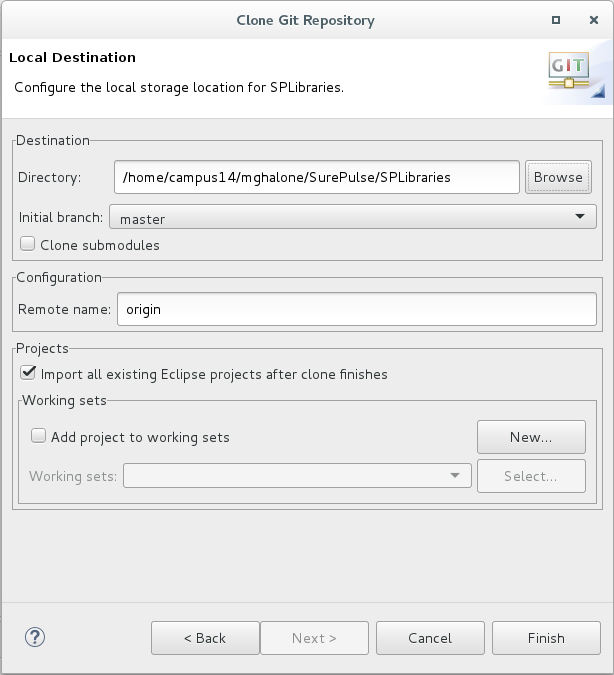
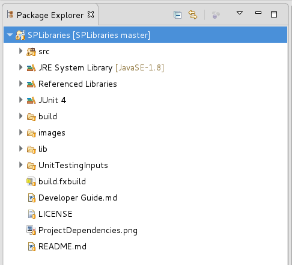
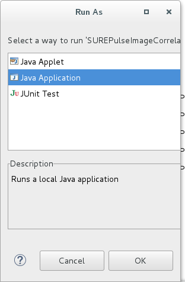
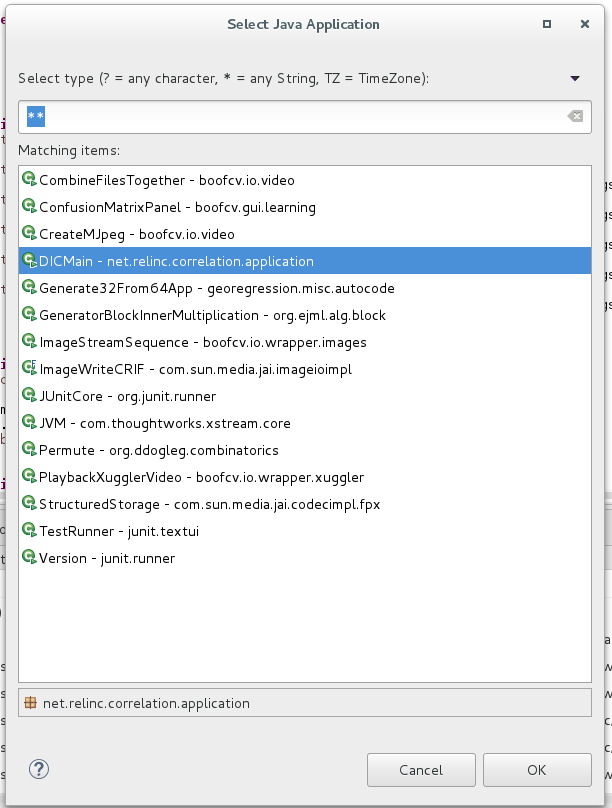
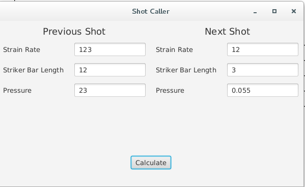
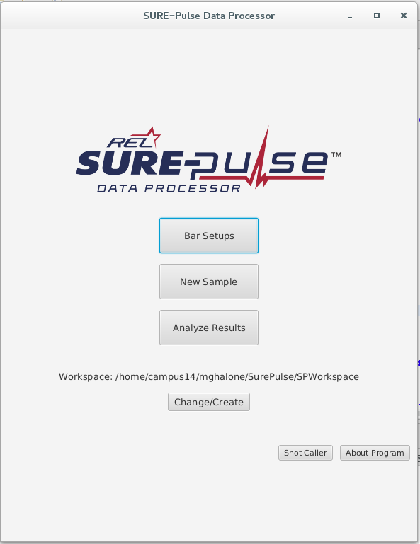

# SURE-Pulse Software Suite Developer Guide
Sure-Pulse is written in Java using the latest Java UI Library, JavaFX. Developers of Sure-Pulse use the Eclipse IDE. Many of the GUIs in SurePulse are in fxml format, which were created in SceneBuilder.

## Overview

### The 3 most important repositories are SPLibraries, SurePulseDataProcessor, and SurePulseViewer.

1. SPLibraries

   Contains common classes that are used by SurePulseDataProcessor and SurePulseViewer
2. SurePulseDataProcessor

   Pictured in red above, the Processor is responsible for creating bar setups and samples.
3. SurePulseViewer

   Pictured in blue above, the Viewer can load saved samples to display graphs and export to Excel.
   
### Project Dependencies
The project dependencies are shown below:

## Steps to set up development environment

**If you get stuck at any point, don't hesistate to ask for help at mark@relinc.net**

1. Install Eclipse
2. Install the git plugin for eclipse (I recommend it). http://www.eclipse.org/egit/
  * Go to Window > Show View > Other.. > Git > and add Git Repositories and Git Staging
3. Install the javaFX plugin for eclipse http://www.eclipse.org/efxclipse/install.html#for-the-lazy
4. Clone SPLibaries from https://github.com/relinc/SPLibraries from the Git Repositories window shown below

When cloning the repository, make sure to change the Destination Directory to your Eclipse workspace. Also, make sure to check "Import all existing Eclipse projects after clone finishes" in the Projects section as shown below.

When the clone and import is complete, SPLibraries should be in your projects and should not contain any errors. It should look something like the image below.

5. In the same fashion, clone https://github.com/relinc/SurePulseViewer
6. Clone https://github.com/relinc/ShotCaller

  You should be able to run ShotCaller. If you are prompted with a "Run As" window, select "Java Application" as shown below

If it prompts you to "Select Java Application", select the method that has "Main" in the name, as shown below.

You should be able to run Shot Caller, as shown below.

7. Clone https://github.com/relinc/DataFileParser
8. Clone https://github.com/relinc/SUREPulseFitter
9. Clone https://github.com/relinc/SUREPulseImageCorrelation
10. Clone https://github.com/relinc/SurePulseDataProcessor
You should now have all the resources to develop SurePulse! 

When everything is said and done, your Eclipse project menu should look like this:

