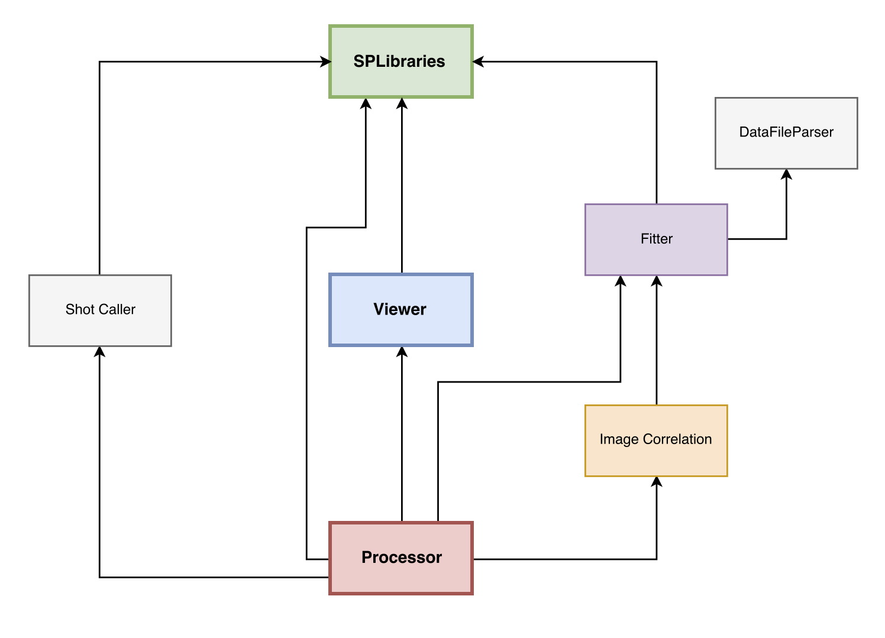

#SURE-Pulse Software Suite Developer Guide
Sure-Pulse is written in Java using the latest Java UI Library, JavaFX. Developers of Sure-Pulse use the Eclipse IDE. Many of the GUIs in SurePulse are in fxml format, which were created in SceneBuilder.
##Overview

###The 3 most important repositories are SPLibraries, SurePulseDataProcessor, and SurePulseViewer.
1. SPLibraries

   Contains common classes that are used by SurePulseDataProcessor and SurePulseViewer
2. SurePulseDataProcessor

   Pictured in red above, the Processor is responsible for creating bar setups and samples.
3. SurePulseViewer

   Pictured in blue above, the Viewer can load saved samples to display graphs and export to Excel.
   
### Project Dependencies
When all the repositories are cloned, the following project dependencies must be created.

## Steps to set up development environment

1. Install Eclipse
2. Install the git plugin for eclipse (I recommend it). http://www.eclipse.org/egit/
  * Go to Window > Show View > Other.. > Git > and add Git Repositories and Git Staging
3. Install the javaFX plugin for eclipse http://www.eclipse.org/efxclipse/install.html#for-the-lazy
4. Clone SPLibaries from https://github.com/relinc/SPLibraries from the Git Repositories window shown below
